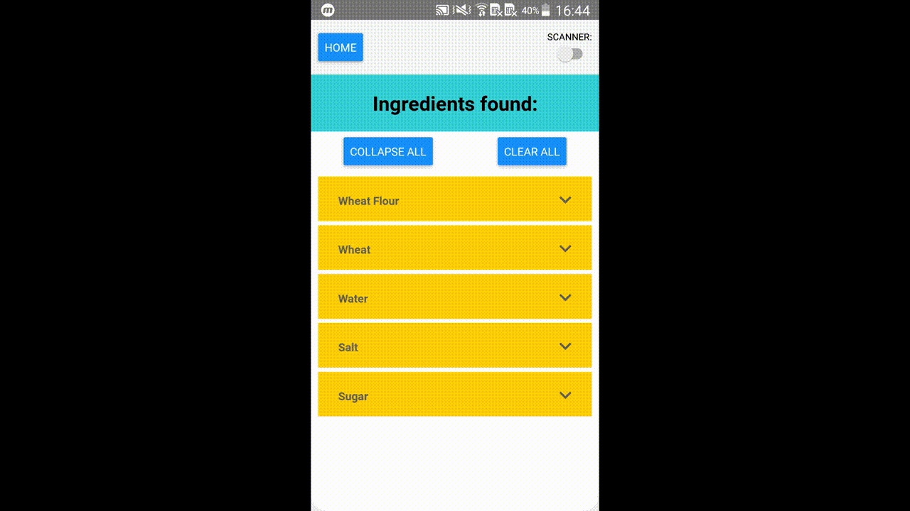

# Foodi

## Demo
Foodi is a mobile app I created to provide users with detailed information about ingredients inside a food product.

To learn more about what is inside a food product, users may scan the ingredients list on the product packaging with the camera built-in on their phones. Also through the use of optical recognition, users may find and scan the barcode on the packaging for ingredient details.

Alternatively, users may search for a specific ingredient by inputting its name. Both food ingredients and chemical ingredients are supported.

## Software Stack
- React Native front end
- Firebase Mobile ML Kit
  - Android optical character and barcode recognition 
- React Native Fetch API
  - Data extraction from the web
- Open Food Facts API
  - Food product barcode data
- Wikipedia search API
  - Ingredients data

